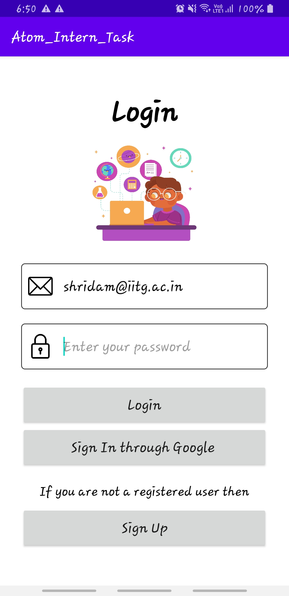
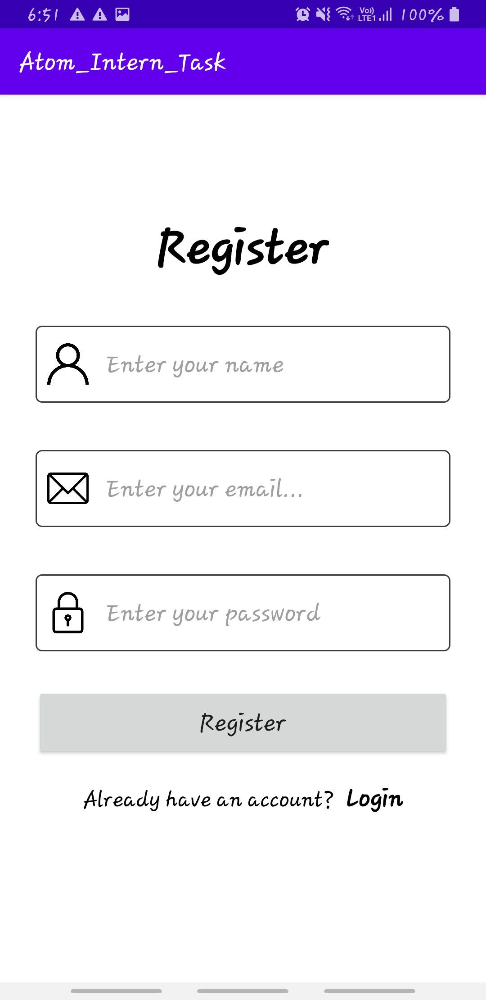
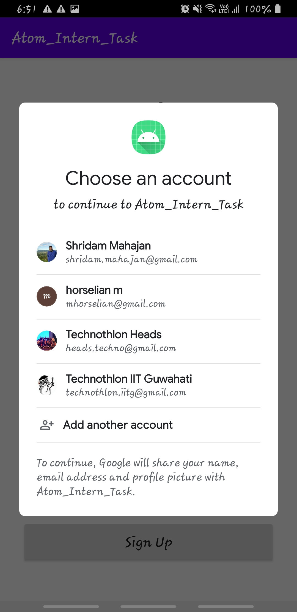
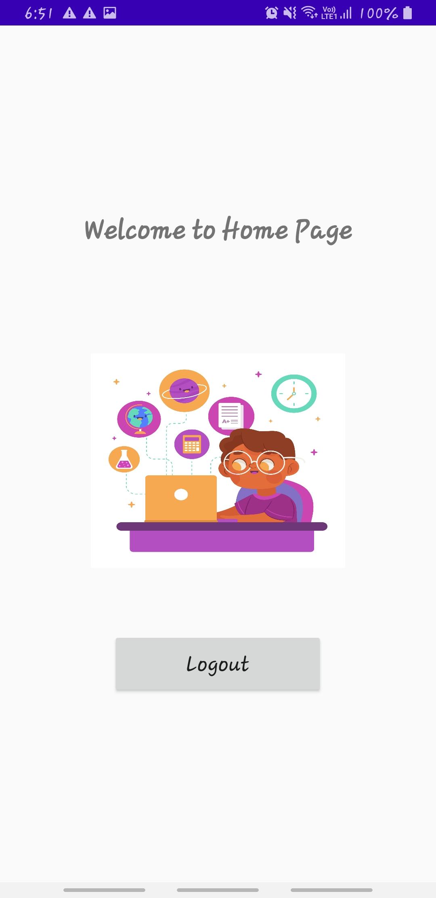
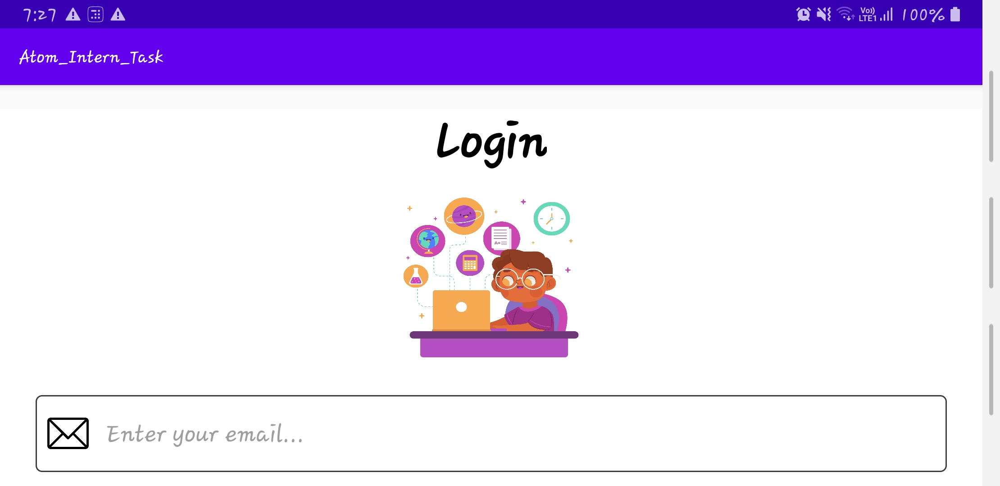
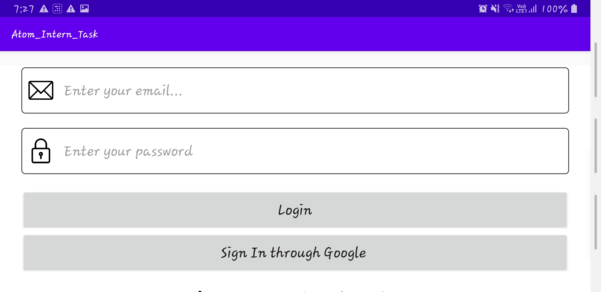

# Atom_Intern_Task
A simple user login/logout app

## What is this?
It's a simple app which let's you login in it and then once logged in you will land into the dashboard page or home page. This app is built by me as a task given to by Atom Technologies during their internship recruitment process.

## Features
<ul>
  <li>You can log in to this app through a custom email id and password which is made by the user when signing up and it gets stored in my firebase account</li>
  <li>This app has a feature of Google signin also which means you can access this app by logging in through your gmail id.</li>
  <li>The user doesn't needs to login everytime when he/she opens the app as the app saves the current user until the user gets user logged out.</li>
  <li>This app is scrollable and responsive, Works fine on both Potrait as well as Landscape mode.</li>
  <li>Even if you are logged in through google sign in method, then also the firebase stores that user.</li>
</ul>

## User Experience workflow
<ul>
  <li>First the user lands upon the login page when the app is opened.</li>
  <li>The user has three options then :- </li>
  <ol>
    <li>The user can login through his/her previous login credentials if he/she is a registered previous user of the app. (custom login)</li>
    <li>The user can login through his/her gmail id (google sign in) as it helps the user to bypass the labor of sign up or custom login.</li>
    <li>If the user is not previously registered or doesn't want to use google sign in method , he/she gets the option of sign up or create a custom account to access the app.</li>
  </ol>
  <li>After the login process the user lands on the default home page and there he/she gets the option of logout.</li>
  </ul>
## What did I build this with?
I used Android Java for the front-end and Firebase for the backend. The development IDE used by me was Android Studio.

## Screenshots of Potrait mode of the App

  &nbsp; &nbsp; &nbsp; 

  &nbsp; &nbsp; &nbsp; 

 

## Screenshots of Landscape mode of the App

&nbsp; &nbsp; &nbsp; 

